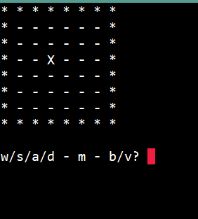
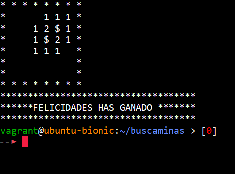

# Buscaminas-en-python

### How Play Buscaminas

Steps:

1) clone this repository:

   > git clone https://github.com/Juan-Bogota/Buscaminas-en-python.git

2) Inside the folder buscaminas-en-python:
   > run buscaminas_3.py is the last version

3) enjoy the game...

## Images

### Start Game

### Game

### for the Win

### You can adjust the game in diferents dimension

You need change the values of filas and columnas in the file buscaminas_3.py

